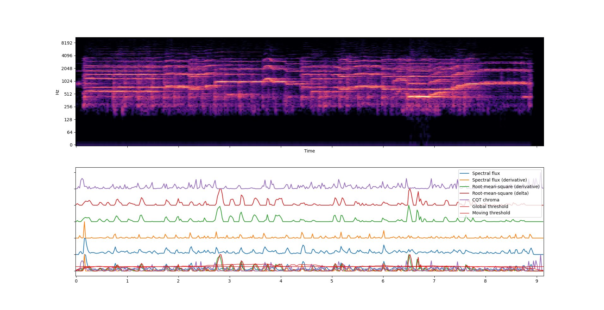
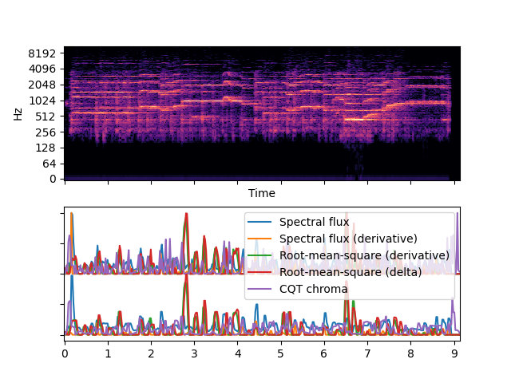

A moderately over-rengineered Python tool for onset detection and visualisation. Under the hood, it is a combination of [`librosa`](https://github.com/librosa/librosa) for the initial analysis, `scipy` for filtering, and `numpy` for additional processing and peak-picking. As with any onset detection, the output will almost certainly need manual adjustment. 

Please note that this project is still very much in development!

**Compare envelopes**


**Compare filtered/unfiltered envelopes**


## Quick Start
CLI:
```bash
python cli.py compare-envelopes path-to-recording # compare different envelopes
python cli.py compare-filtering path-to-recording # compare filtered and unfiltered envelopes
python cli.py detect-onsets path-to-recording # detect onsets using default settings

python cli.py detect-onsets -h # display help
```

In Python:
```python
from onset_detection import OnsetDetect

recording = OnsetDetect("recording.wav")

recording.detect_onsets(
    envelope="hybrid",
    hybrid_env_components=["spectral_flux", "delta_rms"],
    threshold_k=1.5,
    output="list",
    plot=True
)
```

## Configuration Parameters

| Parameter | Type | Default | Description |
| :--- | :--- | :--- | :--- |
| `envelope` | str | `"spectral_flux"` | Feature type: `spectral_flux`, `delta_rms`, `diff_rms`, `chroma_cqt`, or `hybrid`. |
| `hybrid_env_components` | list | `["spectral_flux", "delta_rms"]` | Components to sum if `envelope="hybrid"`. |
| `filtering` | str | `"median_filter"` | Smoothing method: `none` or `median_filter`. |
| `filter_kernel` | int | `3` | Median filter kernel size (must be odd). |
| `threshold_type` | str | `"moving"` | `global` (static) or `moving` (adaptive window). |
| `threshold_k` | float | `0.9` | Sensitivity factor. Lower values increase detection count. |
| `peak_picking` | str | `"backtrack"` | `centroid`, `backtrack` or `librosa`. |
| `merge_onsets` | bool | `False` | Merge detections closer than `min_note_gap`. |
| `min_note_gap` | float | `0.08` | Minimum seconds between distinct notes. |
| `output` | str | `"list"` | Output format: `list`, `rows`, or `csv`. |
| `plot` | bool | `True` | Display visualisation. |

## Installation and Requirements
This project requires a python installation with [`librosa`](https://github.com/librosa/librosa) SciPy, NumPy, and Matplotlib.
It can be run as is or installed locally by running `pip install -e .` in the project directory.
